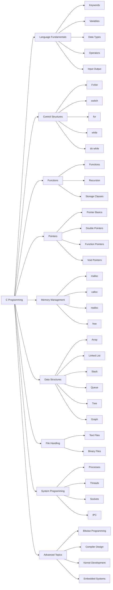

# C Programming Roadmap

```mermaid
flowchart LR

A[C Programming]

A --> B[Language Fundamentals]
A --> C[Control Structures]
A --> D[Functions]
A --> E[Pointers]
A --> F[Memory Management]
A --> G[Data Structures]
A --> H[File Handling]
A --> I[System Programming]
A --> J[Advanced Topics]

B --> B1[Keywords]
B --> B2[Variables]
B --> B3[Data Types]
B --> B4[Operators]
B --> B5[Input Output]

C --> C1[if else]
C --> C2[switch]
C --> C3[for]
C --> C4[while]
C --> C5[do while]

D --> D1[Functions]
D --> D2[Recursion]
D --> D3[Storage Classes]

E --> E1[Pointer Basics]
E --> E2[Double Pointers]
E --> E3[Function Pointers]
E --> E4[Void Pointers]

F --> F1[malloc]
F --> F2[calloc]
F --> F3[realloc]
F --> F4[free]

G --> G1[Array]
G --> G2[Linked List]
G --> G3[Stack]
G --> G4[Queue]
G --> G5[Tree]
G --> G6[Graph]

H --> H1[Text Files]
H --> H2[Binary Files]

I --> I1[Processes]
I --> I2[Threads]
I --> I3[Sockets]
I --> I4[IPC]

J --> J1[Bitwise Programming]
J --> J2[Compiler Design]
J --> J3[Kernel Development]
J --> J4[Embedded Systems]
```
