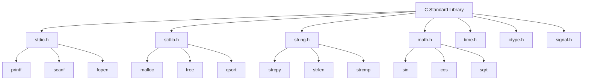
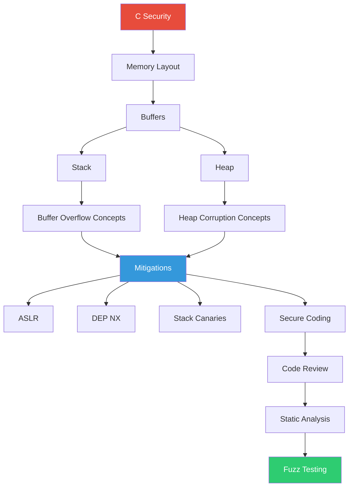
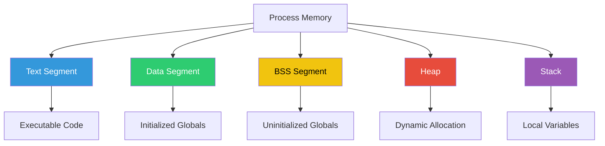

    

        
    

# **`Awesome`** [C](https://github.com/cybersecurity-dev/awesome-c-programming-language) [Programming](https://github.com/cybersecurity-dev/C-Toolkit) Resources 
[**`ANSI C`**](https://wikipedia.org/wiki/ANSI_C) | [**`C99`**](https://wikipedia.org/wiki/C99) | [**`C11`**](https://wikipedia.org/wiki/C11_(C_standard_revision)) | [**`C17`**](https://wikipedia.org/wiki/C17_(C_standard_revision)) | [**`C23`**](https://wikipedia.org/wiki/C23_(C_standard_revision))

## 📖 Contents
- [Books](#books)
- [Blogs](#blogs)
- [Videos](#videos)
- [Reference](#reference)
- [My Other Awesome Lists](#my-other-awesome-lists)
- [Contributing](#contributing)
- [Contributors](#contributors)

## Books
* [C Programming Language](https://www.amazon.com/Programming-Language-2nd-Brian-Kernighan/dp/0131103628)
* [C Programming Absolute Beginner's Guide](https://www.amazon.com/Programming-Absolute-Beginners-Guide-3rd/dp/0789751984)
* [C Programming: A Modern Approach](https://www.amazon.com/C-Programming-Modern-Approach-2nd/dp/0393979504)
* [Effective C : An Introduction to Professional C Programming](https://www.amazon.com/Effective-2nd-Introduction-Professional-Programming/dp/1718504128/)
* [Practical C Programming: Why Does 2+2 = 5986? (Nutshell Handbooks)](https://www.amazon.com/Practical-Programming-Does-Nutshell-Handbooks/dp/1565923065/)
* [C Pocket Reference](https://www.amazon.com/C-Pocket-Reference-Peter-Prinz/dp/0596004362/)
* [Expert C Programming: Deep Secrets](https://www.amazon.com/Expert-C-Programming-Deep-Secrets-ebook/dp/B00E0LASCU/)

## Blogs

## Videos
- [CS50x 2024 - Lecture 1 - C](https://youtu.be/cwtpLIWylAw?si=5HN_Ob8_fS3AtR4d)
- [How I program C by `Eskil Steenberg`](https://youtu.be/443UNeGrFoM?si=-Ryo1qd9Tf_cFJ3P)
- [Tips for C Programming by `Nic Barker`](https://youtu.be/9UIIMBqq1D4?si=zEWJlIhn_5VoOmAG)
- [extern c: Talking to C Programmers about C++ by `Dan Saks`](https://youtu.be/D7Sd8A6_fYU?si=SsoOOWUhv723hGpj)
- [C is So Back: Unbreaking the Charter by `Björkus Dorkus`](https://youtu.be/zLyz4kJvkvQ?si=o2759zzmUc0quVnr)
- [Advice for Writing Small Programs in C by `Sean Barrett`](https://youtu.be/eAhWIO1Ra6M?si=BybQtPH_LWy-_TSI)
- [Programming in Modern C with a Sneak Peek into C23 by `Dawid Zalewski`](https://youtu.be/lLv1s7rKeCM?si=FXLzWT0EZqfcj3z0)
- [Modern C and What We Can Learn From It by `Luca Sas`](https://youtu.be/QpAhX-gsHMs?si=Yws-mvslLTkwJBsv)

### Value Categories

### Security

### Memory

- [Understanding the C runtime memory model](https://youtu.be/3F3lp_F2YpQ?si=uM2zf6Sg5GcoPKoH)

## Reference

##

### My Other Awesome Lists
You can access the my other awesome lists [here](https://cyberthreatdefence.com/my_awesome_lists)

### Contributing
[Contributions of any kind welcome, just follow the guidelines](contributing.md)!

### Contributors
[Thanks goes to these contributors](https://github.com/cybersecurity-dev/awesome-c-programming-resources/graphs/contributors)!

### License

[🔼 Back to top](#awesome-c-programming-resources-)
